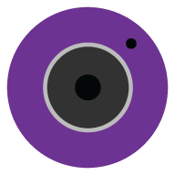

 Circo Icon Pack 
===========================


## Simple, beautiful, colorful icons





## Download

[](https://f-droid.org/packages/com.mookie.circo/)
[](https://play.google.com/store/apps/details?id=com.mookie.circo)

## Contributing
#### Name icons: 
"ic_appname" with all spaces as underscores

#### Placing icons:
- Save icon as 192x192 png
- Add icons do res/drawable-xxxhdpi
- Add .svg or .ai to /IconVectors

#### Add icons: (in order by category, then alphabetically)

res/xml/appfilter.xml in format:
```
<item component="ComponentInfo{Package/Launcher Acitivity}" drawable="ic_appname" />
<!-- Example: -->
<item component="ComponentInfo{com.soundcloud.android/com.soundcloud.android.main.LauncherActivity}" drawable="ic_soundcloud" />
```

res/xml/drawable.xml in format:
```
<item drawable="ic_appname" />
```

#### Use color pallete for instructions and list of colors:

[Color Pallete](CircoPromo/Circo-Pallet.svg)(right-click save-as)

#### Use template, all icons must have same size circle as circle in template:

[Template](CircoPromo/circo-template.svg)(right-click save-as)


## Languages
- English
- Spanish
